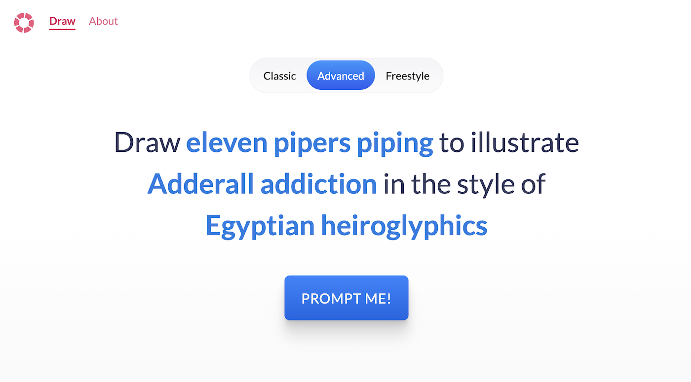
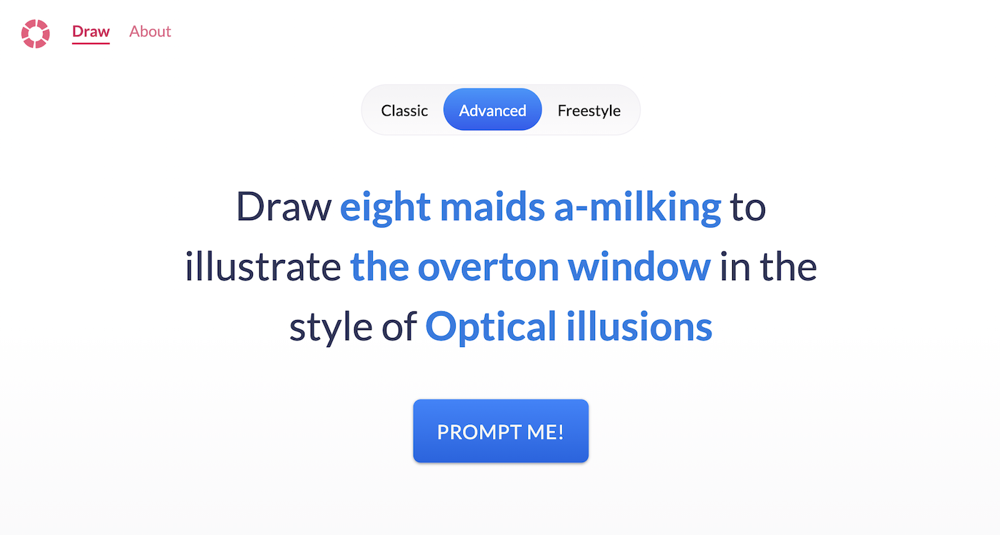

## Prompt Up Your Life

[promptupyour.life](https://promptupyour.life) (henceforth known as PUYL) is here to solve your deep prompting issues.

Combining silly objects with abstruse concepts, it teaches you how to play with visual forms and build conceptual metaphors.

There are three modes: Classic, Advanced, and Freestyle

- Classic gives you a physical _thing_ and an abstract _concept_
- Advanced gives you a physical _thing_, an abstract _concept_, and a visual _style_.
- Freestyle lets you mix and match as many prompt categories as you like. You can pick from _objects_, _abstract concepts_, _visual styles_, _design principles_, and _moods_.

Here are some example prompts PUYL gives:

